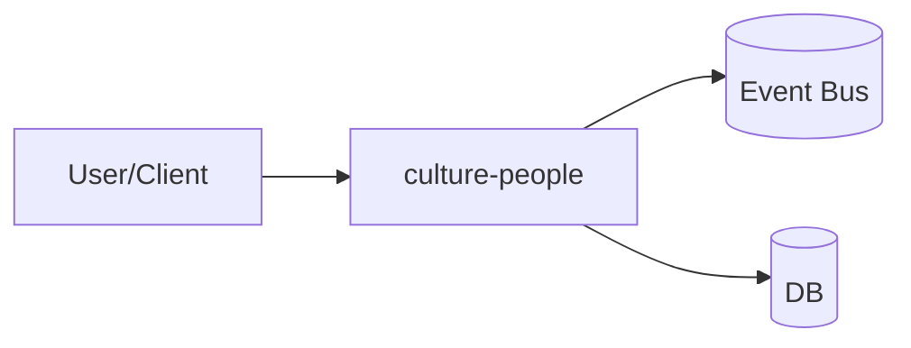
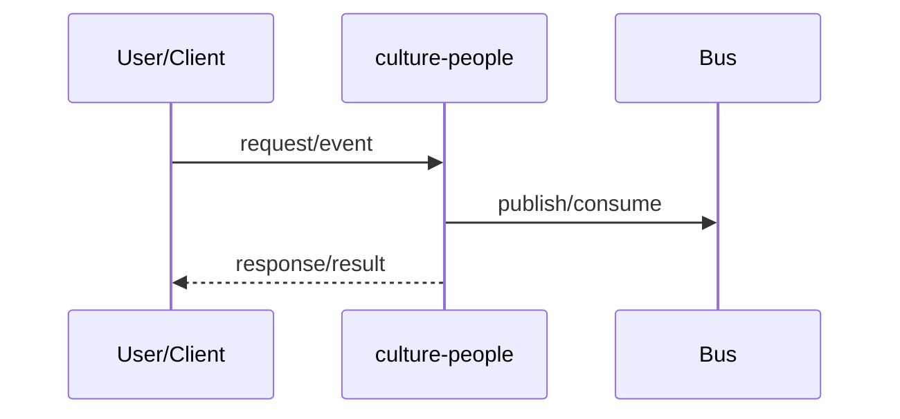

# Pack0 — Planejamento Padrão (culture-people)

**trace_id:** TEST-P0-culture-people

> Este Pack0 é um *artefato de planejamento* (não entrega código executável).
> Ele existe para virar a fonte de verdade do Pack1.

---

## 1 Introdução

### 1.1 Propósito
Definir o planejamento padronizado (SRS) do módulo **culture-people**, com requisitos, casos de uso, rastreabilidade e gates.

### 1.2 Escopo
- Dentro do escopo: thin-slice E2E do módulo culture-people + contratos + testes + runbooks.
- Fora do escopo (por enquanto): tudo que não for necessário para o thin-slice validável.

### 1.3 Características dos Usuários
Perfis (exemplos):
- Operação / Suporte (debug e rollback)
- Admin (configuração e segurança)
- Usuário final (fluxo do produto)

### 1.4 Referências
- Documento de Requisitos (SRS) — `docs/references/documento_de_requisitos_analise_projeto.pdf`
- Estudos GitHub / inspiração — `docs/references/`
- Blueprints do ecossistema LAI (Fonte interna: Pack)
- MeetCore — `docs/references/25.pdf`
- LAI Connect — `docs/references/Lai Connect - blueprint confidencial.pdf`
- App LAI — `docs/references/App lai blueprint - confidencial.pdf` e `docs/references/App Lai - sistema Lai resumo.pdf`
- Culture & People — `docs/references/Lai Culture & People documentacao tecnica.pdf`
- Dicionário de termos sensíveis — `docs/references/LAI_REINTERPRETACAO_BIG_TECH_v2.0.md`

---

## 2 Visão Geral do Produto

### 2.1 Perspectiva do Produto
Como o módulo culture-people se integra aos demais módulos (event bus, contratos, observabilidade, auditoria).

### 2.2 Funcionalidades (resumo)
- RF-001: Definir um fluxo E2E mínimo do módulo culture-people
- RF-002: Publicar/consumir eventos (quando aplicável)
- RF-003: Persistência mínima (quando aplicável)

### 2.3 Ambiente Operacional
- Local: docker-compose
- CI: execução de testes unit/integration/e2e
- Observabilidade: logs estruturados + traces (placeholder ok)

### 2.4 Limitações
- Limites atuais do GPT Builder (ex.: unzip, tamanho, tempo) e mitigação via packs/snapshots.

### 2.5 Suposições e Dependências
- Dependência de contratos versionados
- Dependência de infraestrutura (fila, db, etc.)

---

## 3 Requisitos Funcionais (RF)

> Todo RF deve ser testável e rastreável.

| ID | Descrição | Critério de Aceite | Contratos | Testes |
|---|---|---|---|---|
| RF-001 | Thin-slice E2E do módulo culture-people | fluxo roda local sem intervenção | contracts/* | tests/e2e/* |
| RF-002 | Evento(s) críticos com trace_id | evento validado por schema | contracts/events/* | tests/integration/* |
| RF-003 | Logs estruturados | logs com correlação | — | tests/smoke/* |

---

## 4 Requisitos Não Funcionais (RNF)

| ID | Descrição | Métrica/Alvo | Evidência |
|---|---|---|---|
| RNF-001 | Observabilidade mínima | logs + trace placeholder | observability/* |
| RNF-002 | Segurança mínima | RBAC/TBAC + audit append-only | SECURITY.md + history/* |
| RNF-003 | Determinismo de merge | merge gera snapshot reproduzível | `lai-pack merge` |

---

## 5 Casos de Uso (UC)

### UC-001 — Execução do thin-slice
**Atores:** usuário/serviço  
**Pré-condições:** infra local up  
**Fluxo principal:**  
1. Disparar evento/req  
2. Processar  
3. Persistir/emitir evento  
4. Confirmar resultado

**Fluxos alternativos:** retries, idempotência  
**Erros esperados:** validação, timeout, schema mismatch

### UC-002 — Correção via OCA (PackX.Y)
**Fluxo:** bug → OCA → merge → snapshot → book atualizado

---

## 6 Diagramas (placeholders)

### 6.1 Arquitetura (Mermaid)

### 6.2 Sequência (Mermaid)

### 6.3 Classes (opcional)
Adicionar diagrama de classes apenas se ajudar manutenção.

---

## 7 Rastreabilidade

| Requisito | Contrato | Teste | Runbook | Observabilidade |
|---|---|---|---|---|
| RF-001 | contracts/* | tests/e2e/* | runbooks/HOW_TO_RUN.md | observability/* |
| RF-002 | contracts/events/* | tests/integration/* | runbooks/HOW_TO_RUN.md | observability/* |
| RNF-002 | SECURITY.md | tests/* | runbooks/HOW_TO_DEPLOY.md | history/* |

---

## 8 Plano de Implementação

### 8.1 Estratégia por packs
- Pack0: planejamento + gates
- Pack1: thin-slice executável
- Pack1.1+: correções via OCA + merge + book automático

### 8.2 Tarefas
- [ ] Definir contratos e eventos do módulo culture-people
- [ ] Definir persistência mínima (se aplicável)
- [ ] Definir testes e runbooks
- [ ] Definir rollout/rollback

### 8.3 Riscos
- Drift de padrões → mitigado por DoD + validate-pack0 + book automático
- Falhas em unzip/timeouts → mitigado por snapshots pequenos + inventário

---

## 9 Testes
- Unit: regras e validações
- Integration: contratos/eventos
- E2E: thin-slice

---

## 10 Aceite
Critérios objetivos:
- comandos `make up` e `make test` passam
- validate-pack0 sem lacunas críticas

---

## 11 Rollout
Estratégia mínima:
- stage → prod
- feature flags quando necessário

---

## 12 Rollback
Plano mínimo:
- desativar feature flag (se houver)
- reverter pack para versão anterior

---

## 13 Definition of Done
Referência: `docs/DEFINITION_OF_DONE.md`

